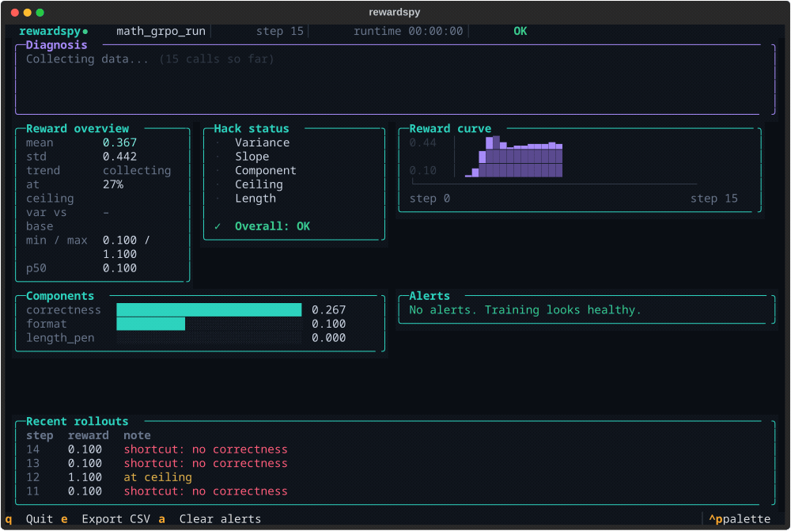

<div align="center">

# rewardspy

**A plug-in debugger and visualizer for RL reward functions.**
Detects reward hacking before it derails your training run.

One import. Zero boilerplate.

[](https://github.com/AvAdiii/rewardspy/actions/workflows/ci.yml)
[](LICENSE)
[](pyproject.toml)

</div>



```python
import rewardspy

# Before
reward = my_reward_fn(response, ground_truth)

# After: full observability, zero other changes
reward = rewardspy.watch(my_reward_fn)(response, ground_truth)
```

Your reward function is never modified. rewardspy is a pure observer.

## Why

Reward hacking is the number one practical failure mode in RL today. An agent
learns to maximize the *proxy* reward by exploiting loopholes instead of solving
the task. The reward curve goes up and to the right, so it looks like success,
right up until you read the rollouts and find the model overwrote its own unit
tests or learned to spam a format token.

When you train today, your debugging toolkit is `print(reward)` and a curve that
looks fine even while the model is hacking. rewardspy wraps your reward function,
watches every call, tracks the statistical signatures of reward hacking in real
time, and renders them in a live terminal dashboard.

The key idea: a reward curve that only goes up is exactly what hacking looks
like. rewardspy is what contradicts the happy curve and tells you why.

## Install

```bash
pip install rewardspy
```

## Quickstart

```python
import rewardspy

reward_fn = rewardspy.watch(my_reward_fn)
# ... run training ...
rewardspy.show(reward_fn)     # launch the live dashboard
```

Track reward components separately by returning a dict:

```python
@rewardspy.watch(name="math", components=["correctness", "format", "length"])
def reward(response, answer):
    correctness = check_answer(response, answer)
    format_ok = has_think_tags(response)
    length_pen = -max(0, len(response) - 2000) / 1000
    return {
        "correctness": correctness,
        "format": format_ok * 0.1,
        "length": length_pen * 0.05,
        "total": correctness + format_ok * 0.1 + length_pen * 0.05,
    }
```

## What it detects

- **Reward variance collapse**: rewards converge to one value (one strategy found).
- **Component dominance**: a cheap component (format, length) drowns out correctness.
- **Response length drift**: verbosity bias or format shortcutting.
- **Reward slope breaks**: a sudden strategy switch, via CUSUM change-point detection.
- **Ceiling saturation**: most rollouts hit the maximum possible reward.
- **GRPO group collapse**: within-group reward variance hits zero (no learning signal).

See [docs/detectors.md](docs/detectors.md) for the math behind each one and
[docs/hack_patterns.md](docs/hack_patterns.md) for a gallery of real patterns.

## Command line

rewardspy streams to JSONL, so the CLI can attach to a live run from another
terminal:

```bash
rewardspy show    logs/run.jsonl --follow    # live dashboard
rewardspy summary logs/run.jsonl --last 500  # text summary + verdict
rewardspy audit   logs/run.jsonl             # verdict, non-zero exit if flagged
rewardspy export  logs/run.jsonl -o out.csv  # convert to CSV (or --format parquet)
rewardspy probe   my_module:reward_fn -p cases.json   # try a reward fn offline
```

`audit` exits non-zero when a hacking signature is found, so you can fail a CI
job or a training script automatically.

## Integrations

```python
from rewardspy.integrations import GRPOSpy, watch_trl
from rewardspy.integrations import wandb as rspy_wandb
```

- **GRPO**: `GRPOSpy` watches each group and flags group reward variance collapse.
- **TRL**: `watch_trl` wraps a batch reward function for `GRPOTrainer`.
- **Weights & Biases**: log rewardspy metrics and alerts next to your curves.

Install extras with `pip install rewardspy[trl]` or `pip install rewardspy[wandb]`.
Parquet export needs `pip install rewardspy[parquet]`.

## Examples

Runnable demos in [`examples/`](examples):

| Example | What it shows |
|---|---|
| `quickstart.py` | The minimal one-line integration, no UI. |
| `healthy_training.py` | A well-designed reward; the dashboard stays green. |
| `detect_hacking.py` | A gamed reward; the dashboard turns red and explains it. |
| `grpo_math.py` | GRPO with `GRPOSpy`, catching group collapse. |
| `trl_integration.py` | A TRL-style batch reward with a verbosity hack. |

Run `healthy_training.py` and `detect_hacking.py` back to back to see the
contrast.

## How it works

Three layers, usable independently:

1. **Wrapper**: intercepts every call, captures timing and components, never
   changes the return value.
2. **Metrics and detectors**: O(1) rolling statistics and five independent hack
   detectors.
3. **Dashboard, CLI, and exporters**: display and persistence.

## Background

The formal name for what rewardspy detects is reward overoptimization, the
Goodhart's Law failure: "when a measure becomes a target, it ceases to be a good
measure." Optimize a proxy reward too hard and the true objective first improves,
then turns around, while the proxy keeps rising. You rarely have the true reward
to compare against during training, so rewardspy tracks statistical proxies for
that divergence instead.

## Contributing

Contributions are welcome. See [CONTRIBUTING.md](CONTRIBUTING.md) for setup, the
project layout, and how to add a detector.

## License

MIT. See [LICENSE](LICENSE).
